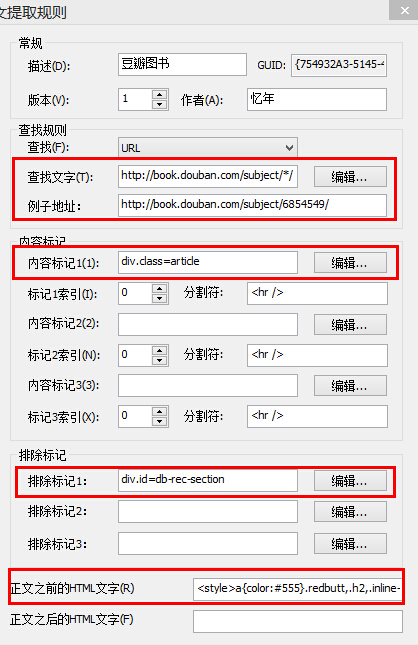

wiz
===

wiznote为知笔记

分享wiz使用过程中的技巧。

大家可以在<a href='https://github.com/kunl/wiz/issues/new'>这里</a>留下你的建议和需求。

1. <a href='豆瓣图书_正文提取规则.md'>豆瓣图书_正文提取规则</a>
2. <a href='新浪博客_正文提取规则.md'>新浪博客_正文提取规则</a>
3. <a href='新浪博客批量提取文章.md'>新浪博客批量提取文章</a>

	###豆瓣图书 示意

