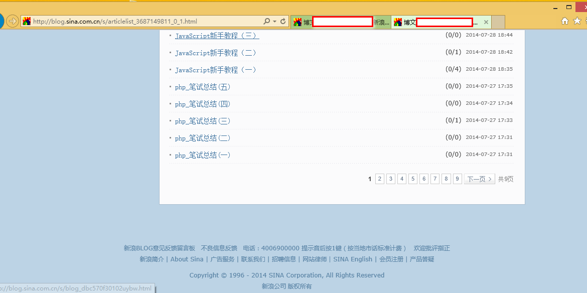
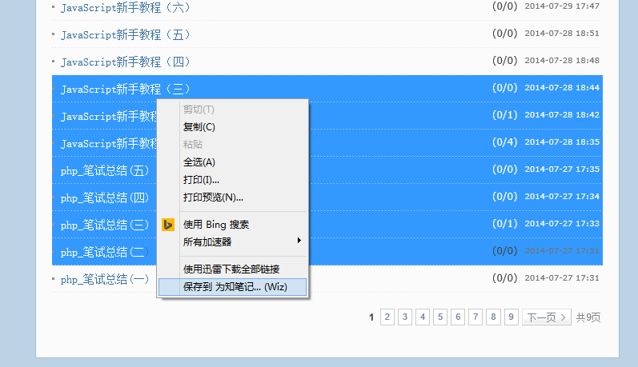
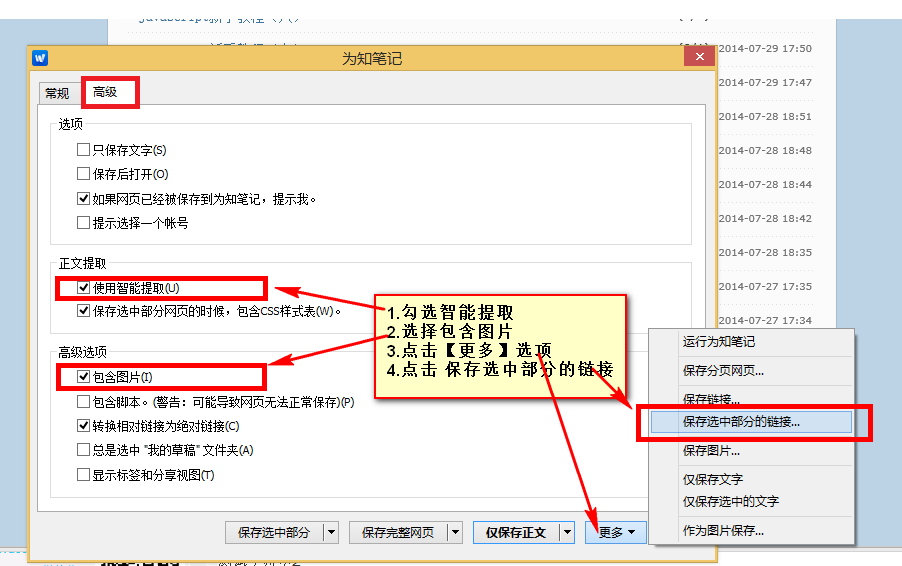
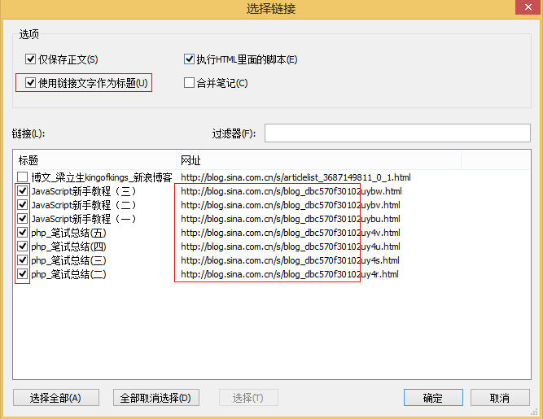

<meta charset='utf-8'>
##新浪博客文章批量提取

wiz有个很不错的功能，就是当大家收集有同一个博客下的文章的时候，可以批量自动收集。

具体做法（新浪博客为例）
###1，在IE浏览器下，跳转到博客的文章列表页

    
###2，选中多个文章标题=》右键=》保存到 位置笔记，如图
    

    
### 3，在弹出的界面选择【高级】=》勾选【智能提取】，【包含图片】=》点击【更多】=》【保存选中部分链接】

###4，勾选需要保存的文章标题，确保上方使用链接文字作为标题

###5，最后，点击确定按钮，wiz就开始批量保存相关文章了。

###可能遇到的问题
 wiz对新浪博客优化的比较好，在第3步的时候，勾选了【智能提取】，但是保存的结果还有文章以外的内容，如：广告，用户侧边栏等。这种情况下就需要用到wiz的另一个强大的功能【正文提取规则】。大家可以在根目录下找到相关的提取规则，或者自己手动制作一些。
 
###附上<a href='新浪博客_正文提取规则.md'>【新浪博客的正文提取规则】</a>
 
 
如果实在不理解，也可以在<a href='https://github.com/kunl/wiz/issues/new'>这里</a>留言说明你的需求，留下你的联系方式，我看到后会尽快帮助你，当然也可以在官方群里直接@忆年,我看到后也会帮助大家。

欢迎大家在这里补充相关的使用心得、技巧，讨论wiz使用过程中的问题。